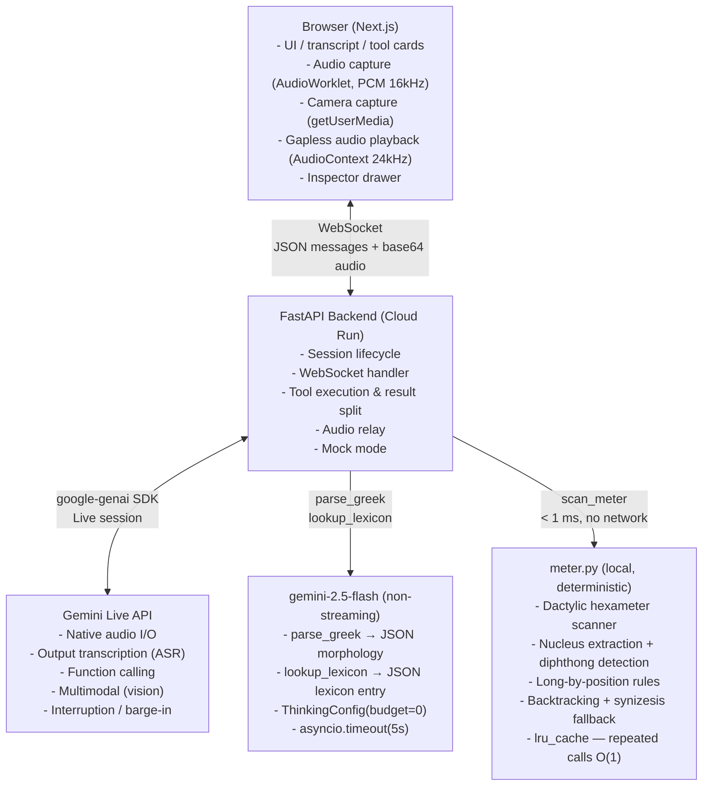

# Architecture — ΛΟΓΟΣ

## System Diagram



## Message Flow

```
User sends audio (voice)
  → useAudioCapture (AudioWorklet, PCM 16-bit 16kHz mono)
  → Frontend: { type: "input.audio", audio: base64 }
  → Backend: session.send_realtime_input(audio=Blob)
  → Gemini Live: native audio processing + VAD
  → Gemini Live: sends audio response + output_transcription
  → Backend: AudioDeltaMessage(audio=base64 PCM 24kHz) × N   → gapless AudioContext playback
  → Backend: TextDeltaMessage(delta=sanitized_transcript) × N → streaming bubble
  → Backend: AudioDoneMessage + TextDoneMessage

User sends text
  → Frontend: { type: "input.text", text: "..." }
  → Backend: session.send_client_content(Content(role="user", parts=[Part(text=...)]))
  → Gemini Live: streams response as audio + transcription
  → Backend → Frontend: same audio + text path as above

User sends image
  → Frontend: { type: "input.image", image: base64, mime_type }
  → Backend: send_client_content with inline_data Blob + instruction Part
  → Gemini Live: multimodal analysis, responds as audio + transcription

Gemini calls parse_greek / lookup_lexicon
  → Backend receives tool_call from Gemini Live session
  → Backend: ToolCallMessage(tool_name, args, call_id) → Frontend (Inspector)
  → Backend: execute_tool_live() → gemini-2.5-flash non-streaming call
      - ThinkingConfig(thinking_budget=0) to avoid extended-thinking stall
      - asyncio.timeout(5.0) hard limit; falls back to mock on timeout
  → Backend strips _INTERNAL_RESULT_FIELDS (_timing_ms etc.)
  → Backend: ToolResultMessage(call_id, frontend_result) → Frontend (ParseCard / LexiconCard)
  → Backend: send_tool_response(spoken_result) → Gemini Live
      - spoken_result has visual-only fields removed (transliteration, IPA,
        principal_parts, key_refs) so model cannot narrate them in audio

Gemini calls scan_meter
  → Backend: execute_tool_live("scan_meter", args, client)
  → meter.py: scan_hexameter(line) — fully local, deterministic, < 1 ms
      Pipeline: tokenize → extract nuclei (diphthong/diaeresis handling)
               → assign quantities (long/short/common, position rules, ζξψ double)
               → _fit_hexameter backtracking → synizesis fallback
  → Backend strips pattern + analysis from spoken_result (visual-only)
  → Frontend: ScansionCard renders meter header + pattern + foot-by-foot table

User interrupts
  → Frontend: stopAudio() sets playbackEnabledRef=false (blocks stale in-flight audio)
  → Frontend: { type: "input.interrupt" }
  → Backend: session.send_client_content(turns=[], turn_complete=True)
  → In-flight audio.delta messages are silently discarded by playbackEnabledRef guard
```

## Architecture Decision Records

### ADR-1: Backend as Gateway, Not Proxy
The backend manages the Gemini session lifecycle, executes tool calls, sanitizes transcripts, applies the spoken-safe result split, and enriches inspector events. The frontend is stateless with respect to the AI session.

### ADR-2: Mock Mode as First-Class Citizen
`MOCK_MODE=true` (auto-enabled when no API key is set) activates `mock_mode.py`, which replicates the exact same WebSocket protocol including tool call/result events. The frontend cannot distinguish mock from live — this ensures demos always work without credentials.

### ADR-3: Tool Execution — Local Scanner + Separate LLM Call
`scan_meter` uses a fully local deterministic hexameter scanner (`meter.py`). No network call, no LLM, sub-millisecond with `lru_cache`. This eliminates the 97-second latency previously caused by `gemini-2.5-flash` extended thinking on JSON generation.

`parse_greek` and `lookup_lexicon` use a separate non-streaming call to `gemini-2.5-flash` with `ThinkingConfig(thinking_budget=0)` and a 5-second hard timeout. This gives structured JSON morphological data without a separate linguistics database. If the call times out, mock data is returned with an `_error` annotation.

### ADR-4: WebSocket, Not REST Polling
Gemini Live is inherently streaming and bidirectional. WebSocket is the only transport that supports this without complex polling or SSE workarounds. One WS connection per browser session maps to one Gemini Live session.

### ADR-5: Audio Pipeline
**Capture:** Browser captures PCM 16-bit 16kHz mono via `AudioWorkletNode` (`/public/pcm-processor.js`). The worklet runs off the main thread, preventing heavy React renders from causing audio frame drops.

**Playback:** Gemini audio responses arrive as base64 PCM 24kHz chunks. Each chunk is decoded and scheduled with `AudioContext.createBufferSource().start(preciseTime)` so chunks play gaplessly end-to-end without clicks or pops.

**Interruption guard:** `playbackEnabledRef` is set `false` on `stopAudio()` and `true` on session-live. In-flight `output.audio.delta` messages arriving after an interrupt are silently dropped, preventing stale audio from reactivating the AudioContext.

### ADR-6: Spoken-Safe Tool Result Split
The full tool result (including transliteration, IPA, `principal_parts`, `key_refs`, `pattern`, `analysis`) is sent to the frontend for rich card rendering. A stripped copy — `_make_spoken_safe()` in `gemini_client.py` — is sent back to the Gemini Live session via `send_tool_response`. This ensures the model cannot narrate visual-only fields even if it ignores system-prompt instructions, since the data is simply absent from its context.

### ADR-7: Transcript Sanitization Layer
Gemini Live audio transcription can emit `<ctrl46>` and similar internal tokens alongside genuine non-printable characters. A `_sanitize_transcript()` pass (backend) and `sanitizeText()` (frontend) strip both. A `_TRANSLIT_PARENS_RE` regex additionally removes `GreekWord (latinTranslit)` patterns that the model may generate despite prompt instructions — providing defense-in-depth against transliteration appearing in the transcript text.
