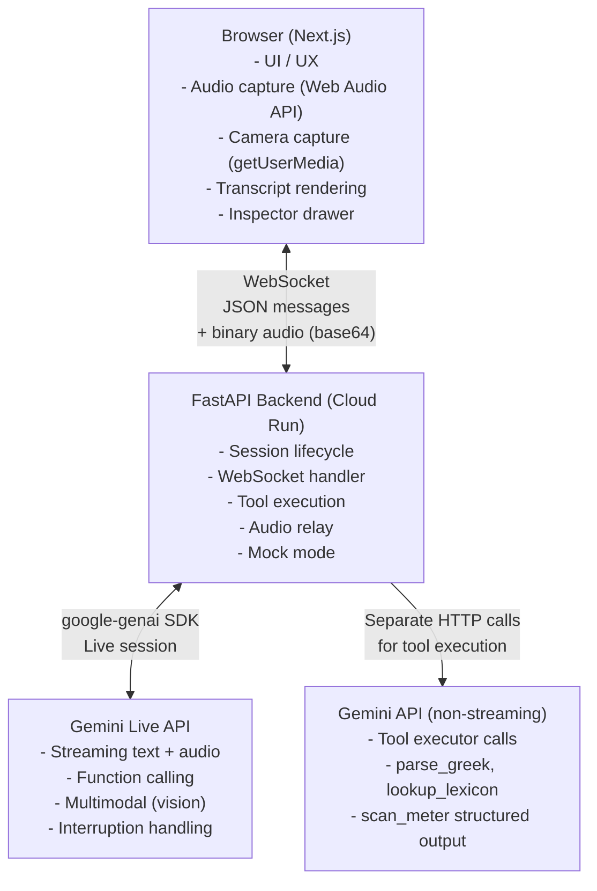

# Architecture — ΛΟΓΟΣ

## System Diagram



## Message Flow

```
User types text
  → Frontend: { type: "input.text", text: "..." }
  → Backend: session.send(input=text)
  → Gemini: streams response tokens
  → Backend: { type: "output.text.delta", delta: "..." } × N
  → Backend: { type: "output.text.done", full_text: "..." }
  → Frontend: renders token-by-token in TranscriptView

User sends image
  → Frontend: { type: "input.image", image: base64, mime_type: "image/jpeg" }
  → Backend: session.send(LiveClientRealtimeInput with Blob)
  → Gemini: processes image, streams description
  → Backend → Frontend: text deltas as above

Gemini calls parse_greek tool
  → Backend receives tool_call from Gemini
  → Backend: { type: "tool.call", tool_name, args, call_id } → Frontend (inspector)
  → Backend: execute_tool_live() → separate Gemini call for structured JSON
  → Backend: { type: "tool.result", call_id, result } → Frontend (ParseCard)
  → Backend: sends FunctionResponse back to Gemini
  → Gemini: continues generation with tool result context
```

## Architecture Decision Records

### ADR-1: Backend as Gateway, Not Proxy
The backend does not blindly forward messages. It manages the Gemini session lifecycle, executes tool calls, converts audio formats, and enriches inspector events. This keeps the frontend simple and stateless.

### ADR-2: Mock Mode as First-Class Citizen
`MOCK_MODE=true` (auto-enabled when no API key is set) activates `mock_mode.py` which replicates the exact same WebSocket protocol. The frontend cannot distinguish between mock and live — this ensures the demo always works.

### ADR-3: Tool Execution via Separate Gemini Call
When Gemini calls `parse_greek`, the backend makes a non-streaming call to `gemini-2.0-flash-001` with a structured prompt asking for JSON morphological analysis. This gives us structured data without maintaining a separate Greek linguistics database.

### ADR-4: WebSocket, Not REST Polling
Gemini Live is inherently streaming and bidirectional. WebSocket is the only transport that supports this without complex polling or SSE workarounds. One WS connection per browser session, one Gemini Live session per WS.

### ADR-5: Audio Handling
Browser captures PCM 16-bit 16kHz mono via ScriptProcessorNode (TODO: migrate to AudioWorklet). Backend forwards as `audio/pcm;rate=16000` blob to Gemini. Gemini audio responses are relayed as base64 PCM chunks for playback via AudioContext at 24kHz.
