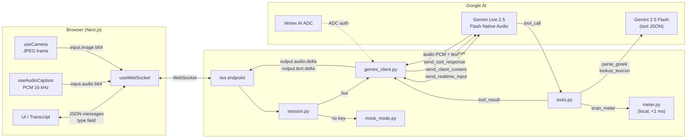

# Architecture

```mermaid
flowchart LR
    subgraph Browser["Browser (Next.js)"]
        UI["UI / Transcript"]
        WS_C["useWebSocket"]
        Audio["useAudioCapture\nPCM 16 kHz"]
        Camera["useCamera\nJPEG frame"]
    end

    subgraph Backend["FastAPI · Cloud Run"]
        WS_S["/ws endpoint"]
        Router["session.py"]
        GC["gemini_client.py"]
        Tools["tools.py"]
        Meter["meter.py\n(local, <1 ms)"]
        Mock["mock_mode.py"]
    end

    subgraph Gemini["Google AI"]
        Live["Gemini Live 2.5\nFlash Native Audio"]
        Flash["Gemini 2.5 Flash\n(tool JSON)"]
        Vertex["Vertex AI ADC"]
    end

    UI <-->|"JSON messages\ntype field"| WS_C
    Audio -->|"input.audio b64"| WS_C
    Camera -->|"input.image b64"| WS_C
    WS_C <-->|WebSocket| WS_S
    WS_S --> Router
    Router -->|live| GC
    Router -->|no key| Mock
    GC <-->|"send_client_content\nsend_realtime_input"| Live
    Live -->|"tool_call"| Tools
    Tools -->|"parse_greek\nlookup_lexicon"| Flash
    Tools -->|"scan_meter"| Meter
    Tools -->|"tool_result"| GC
    GC -->|"send_tool_response"| Live
    Live -->|"audio PCM + text"| GC
    GC -->|"output.audio.delta\noutput.text.delta"| WS_S
    Vertex -.->|ADC auth| GC
```
